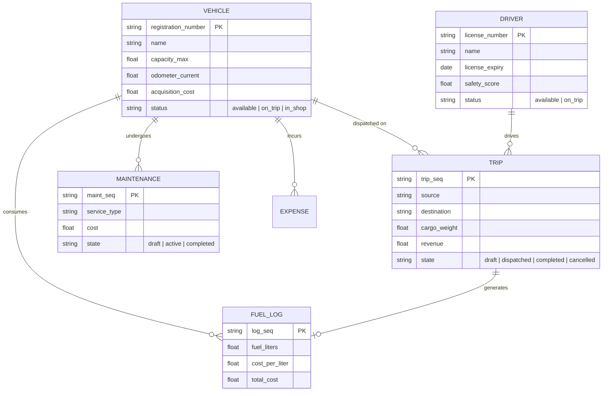
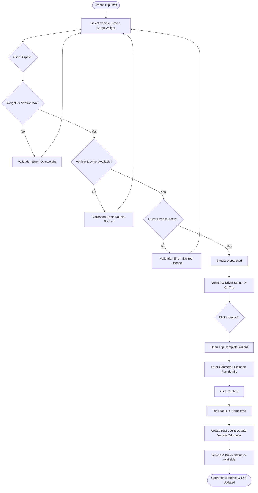

# TransitOps — Smart Transport Operations Platform

TransitOps is a centralized fleet and transport operations platform designed to digitize vehicle, driver, dispatch, maintenance, and expense management. Built as a custom Odoo 19 module, it enforces business logic, automates status transitions, implements role-based access controls, and provides dynamic visual dashboard analytics.

> [!TIP]
> **Documentation Hub Available**: A responsive, animated HTML documentation dashboard is located at the root of the project. Simply open the [index.html](file:///e:/Ansh-Stuffings/Work/Github/odoo-workspace/TransitOps/index.html) file in any web browser to view the interactive setup, workflow timeline, and role matrix guides.

---

## Key Features

### 1. Dashboard & Real-Time KPIs
- Display real-time operational metrics:
  - **Fleet Utilization (%)**: (Vehicles On Trip / Total Fleet Vehicles) * 100.
  - **Vehicle Fleet Summary**: Available, On Trip, and In Shop (Maintenance) vehicle counts.
  - **Operations Summary**: Active Trips, Pending Trips, and Drivers On Duty counts.
- Dynamic group visibility: Hides or shows dashboard cards based on the logged-in user's role.

### 2. Vehicle Registry & Lifecycle Management
- Master registry containing name, registration, model, dimensions, status, and acquisition cost.
- **SQL Constraints**: Database-level unique registration number checks.
- **Dependency Aggregations**: Materialized `vehicle_roi` and `fuel_efficiency` compute automatically when trips, fuel logs, or maintenance records are logged.

### 3. Driver Management & Compliance
- Comprehensive driver registry detailing license number (unique), license category, contact, and safety score.
- Validation checks to automatically prevent assignment of drivers with expired licenses or suspended status.
- License expiry email warnings sent automatically 30 days before expiration.

### 4. Smart Trip Dispatch Engine
- Fully managed trip records (Draft → Dispatched → Completed → Cancelled).
- **Core Validations (Enforced before dispatch)**:
  - Cargo weight verification against the vehicle's maximum load capacity.
  - Double-booking prevention for drivers and vehicles.
  - Compliance check (expired license or suspended status).
- **Automatic Status Synchronization**:
  - Dispatching a trip shifts both the vehicle and driver to `On Trip` status.
  - Completing a trip shifts both back to `Available` status.

### 5. Maintenance Workflow
- Direct logging for maintenance events (e.g., Oil Change, Engine Repair).
- Active maintenance logs automatically shift vehicle status to `In Shop`, immediately hiding it from the trip dispatch vehicle selector pool.
- Closing maintenance restores vehicle status to `Available`.

### 6. Fuel & Expense Management
- Fuel logs linked to vehicles.
- Operational expenses tracker (toll, miscellaneous, linked maintenance cost).
- Automatic calculation of **Total Operational Cost** (Fuel + Maintenance) per vehicle.

### 7. Reports & Analytics
- Stored database attributes for graph and pivot analytics:
  - **Fuel Efficiency** (Distance / Fuel consumed).
  - **Operational Costs** and **Vehicle ROI** computed using:
    $$\text{Vehicle ROI} = \frac{\text{Revenue} - (\text{Maintenance} + \text{Fuel})}{\text{Acquisition Cost}}$$
- QWeb PDF exports for trip details, vehicle operations, and fleet summaries.

---

## System Architecture & Database Schema

### 1. Entity-Relationship Diagram (ERD)
The entity-relationship diagram below maps out the schema relationships and cardinalities across all custom Odoo models:



### 2. Operations Workflow & Trip Dispatch Engine
The flowchart below documents the automated validations checked by Odoo during dispatch, status locks, and the trip completion wizard execution:



## Preview
### 1. Fleet Operations Dashboard


### 2. Smart Trip Dispatch Form


### 3. Trip Wizard


### 4. Active Maintenance Pool Lock


### 5. Real-Time Analytics & ROI Charts

<br><br>


### 6. Role-Based Access Control navbar comparisons


---

## Role-Based Access Control (RBAC) & Test Accounts

We pre-configured test users for all 4 roles inside the database to simplify manual verification. You can log out of the Odoo administrator account and log in using any of the credentials below (all passwords are **`admin`**):

| Username | Role Name | Authorized Navbar Menus | Visible Dashboard Cards |
| :--- | :--- | :--- | :--- |
| **`fleet`** | Fleet Manager | Dashboard, Fleet, Maintenance, Analytics, Settings | Fleet Utilization, Vehicle Fleet |
| **`dispatcher`** | Driver / Dispatcher | Dashboard, Fleet, Drivers, Trips | Fleet Utilization, Vehicle Fleet, Operations |
| **`safety`** | Safety Officer | Dashboard, Drivers, Trips | Operations |
| **`finance`** | Financial Analyst | Dashboard, Fleet, Fuel & Expenses, Analytics | Fleet Utilization, Vehicle Fleet |
| **`admin`** | Super Admin | All Menus | All Cards |

---

## Installation & Setup

### 1. Configure Environment variables
Copy the `.env.example` file to `.env` and fill in your secure database passwords:
```bash
cp .env.example .env
```

### 2. Run Odoo Stack
Start Odoo 19 and PostgreSQL 17 containers using Docker Compose:
```bash
docker compose up -d
```
The web application will be accessible at **`http://localhost:8069`**.

### 3. Running Automated Tests
We wrote a comprehensive integration test suite verifying registrations, dispatch validations, wizard inputs, and dashboard aggregates. Run it inside the container using:
```bash
docker exec -u 0 odoo19_app odoo -d odoo19 -u transit_ops --test-tags=transit_ops --stop-after-init --http-port=8070
```
A clean exit code with `0 failed, 0 errors` confirms system compliance.

---

## Team Distribution Plans
The team task distribution files are located in:
* `docs/plan_member_1.md` (Core Models & Trip Engine)
* `docs/plan_member_2.md` (Operations, Finance & Security)
* `docs/plan_member_3.md` (Dashboard, Analytics, Reports & Polish)
